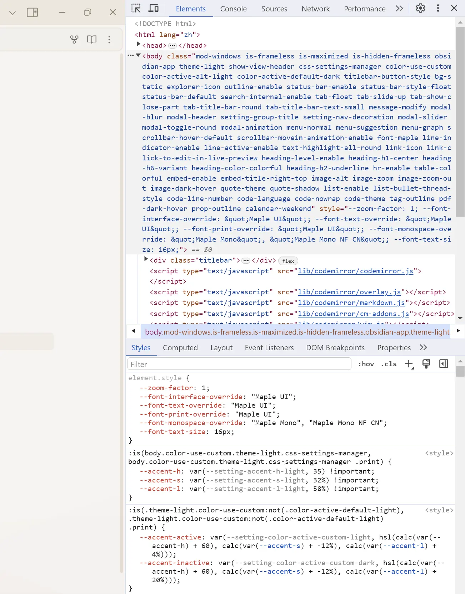
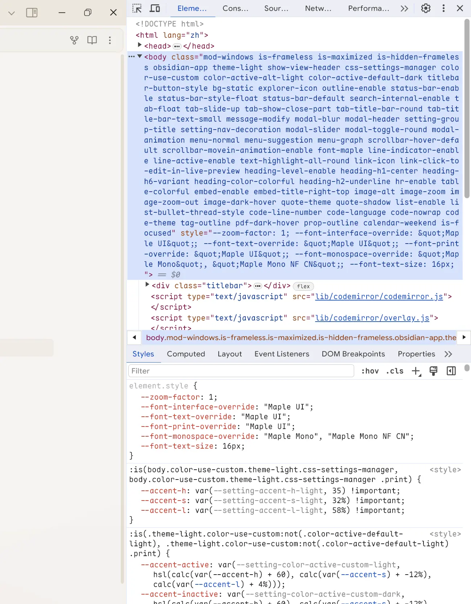

## Devtools Font & Scrollbar

Make ChromeDevTools' fonts match your settings and round the scrollbar

### Effect on Windows

|                         before                          |                          after                           |
| :-----------------------------------------------------: | :-------------------------------------------------------: |
|  |  |
|     font family is `consolas`, sharp scrollbar      |             font family is [`Maple Mono`](https://github.com/subframe7536/maple-font), rounded scrollbar             |

### Get Started

1. Download this repository.
2. Copy it into your vault's `.obsidian/plugins` directory.
3. In Obsidian, close the devtools
4. Navigate to **Settings** → **Community plugins**.
5. Press **Turn on community plugins** if you haven't already.
6. Find `Devtools Font & Scrollbar` in the list of **Installed plugins** and toggle it on.
7. Press <kbd>Ctrl + Shift + I</kbd> and checkout the devtools
8. Everything is done 🎉

### Notice

This plugin is designed for personal use. It has not been tested on every platform and may not work as expected with all future updates. If you notice something is not working as intended, please open a bug report or pull request so it can be fixed.